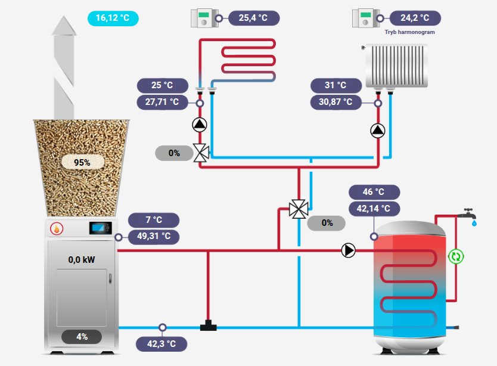

# EcoNET 300 - Integracja z Home Assistant

Integracja umożliwiająca monitorowanie parametrów kotła Kostrzewa wyposażonego w moduł internetowy **EcoNET 300** w systemie Home Assistant.

## O module EcoNET 300

EcoNET 300 to zaawansowany moduł komunikacyjny, umożliwiający zarządzanie pracą sterowników zainstalowanych w kotłach Kostrzewa. Dzięki niemu możemy:

- **Zdalnie monitorować** parametry pracy kotła przez telefon, tablet lub komputer
- **Kontrolować pracę kotła** za pomocą aplikacji ecoNET App (iOS/Android) lub przez stronę www.4pellet.pl
- **Analizować zużycie paliwa** i koszty ogrzewania
- **Otrzymywać powiadomienia** o awariach i problemach
- **Umożliwić serwisowi** zdalną diagnostykę urządzenia

Więcej informacji: [Moduł internetowy EcoNET 300](https://www.kostrzewa.com.pl/blog/modul-internetowy-econet-300-dla-inteligentnego-zarzadzania-cieplem)

## Monitorowane parametry

Integracja udostępnia następujące sensory:

### Podstawowe parametry kotła
- **Tryb pracy** - aktualny stan kotła (wyłączony, rozpalanie, praca, postój, czyszczenie, wygaszanie, rozżarzanie)
- **Moc kotła** - aktualna moc w kW
- **Poziom paliwa** - zapełnienie zbiornika w %
- **Podawanie paliwa** - ilość podawanego paliwa w kg/h
- **Nadmuch** - moc wentylatora w %
- **Płomień** - sygnał z czujnika optycznego w %

### Temperatury
- **Temperatura kotła** - aktualna i zadana temperatura kotła
- **Temperatura powrótu** - temperatura wody powracającej do kotła
- **Temperatura CWU** - aktualna i zadana temperatura ciepłej wody użytkowej
- **Temperatura podajnika** - temperatura w podajniku paliwa
- **Temperatura zewnętrzna** - temperatura z czujnika zewnętrznego

### Mieszacze (2 obvody)
- **Temperatura MIX 1/2** - aktualna i zadana temperatura każdego obvodu
- **Pompa mieszacz 1/2** - stan pracy pompy
- **Położenie zaworu mieszacza 1/2** - pozycja zaworu w %
- **Termostat pokojowy mieszacza 1/2** - sygnał z termostatu pokojowego

### Pompy
- **Pompa kotła** - stan pracy pompy kotła
- **Pompa CWU** - stan pracy pompy ciepłej wody użytkowej
- **Pompa cyrkulacyjna** - stan pracy pompy cyrkulacyjnej

### Termostat pokojowy
- **Temperatura termostatu pokojowego** - aktualna i zadana temperatura w pomieszczeniu
- **Tryb pracy termostatu** - harmonogram/noc/dzień/wyłączony/wietrzenie/grzej teraz/wakacje/przeciwzamrożeniowy

### Dodatkowe parametry
- **Zapełnienie popielnika** - poziom zapełnienia popielnika w %

## Instalacja

### 1. Przygotowanie konfiguracji

Pobierz pliki z tego repozytorium:
- `econet.yaml` - konfiguracja sensorów
- `secrets.yaml` - przykładowa konfiguracja sekretów

### 2. Konfiguracja Home Assistant

1. **Dodaj include do configuration.yaml:**
   ```yaml
   sensor: !include_dir_merge_list sensors/
   ```

2. **Utwórz katalog sensors** w katalogu konfiguracyjnym Home Assistant

3. **Skopiuj plik econet.yaml** do katalogu `sensors/`

4. **Skonfiguruj secrets.yaml** - dodaj dane uwierzytelniające:
   ```yaml
   econet_username: "admin"
   econet_password: "admin"
   ```

5. **Zmień adres IP** - w pliku `econet.yaml` zamień wszystkie wystąpienia `[IP]` na rzeczywisty adres IP Twojego urządzenia EcoNET 300

6. **Zrestartuj Home Assistant**

### 3. Weryfikacja

Po restarcie powinny pojawić się nowe encje w Home Assistant. Możesz je znaleźć w:
- **Developer Tools** → **States** - wyszukaj encje zaczynające się od `sensor.`
- **Settings** → **Devices & Services** → **Entities** - filtruj po nazwie

## Przykładowa wizualizacja



Plik `screen.png` przedstawia przykładowy dashboard pokazujący:
- Aktualną temperaturę zewnętrzną (16,12°C)
- Parametry pracy kotła (temperatura, moc, tryb pracy)
- Stan mieszaczy i pomp
- Poziom paliwa w zbiorniku (95%)
- Temperatury w różnych punktach instalacji
- Harmonogram pracy termostatu pokojowego

## Konfiguracja zaawansowana

### Częstotliwość odczytu

W pliku konfiguracyjnym można dostosować częstotliwość odczytu poszczególnych parametrów:
- `scan_interval: 10` - odczyt co 10 sekund (tryb pracy, płomień)
- `scan_interval: 15` - odczyt co 15 sekund (temperatury zadane, termostat)
- `scan_interval: 30` - odczyt co 30 sekundy (zawory, popielnik)
- `scan_interval: 60` - odczyt co minutę (pozostałe parametry)

### Uwierzytelnianie

Moduł EcoNET 300 wymaga uwierzytelniania Basic Auth. Domyślne dane logowania: admin/admin.

### Endpoints API

Integracja korzysta z dwóch głównych endpointów:
- `/econet/regParams` - podstawowe parametry pracy kotła
- `/econet/regParamsData` - dodatkowe parametry numeryczne

## Rozwiązywanie problemów

### Brak danych z sensorów
1. Sprawdź połączenie z modułem EcoNET 300
2. Zweryfikuj adres IP urządzenia
3. Upewnij się, że dane uwierzytelniające są poprawne
4. Sprawdź logi Home Assistant w poszukiwaniu błędów

### Błędy autoryzacji
- Upewnij się, że używasz tych samych danych co w aplikacji ecoNET App
- Sprawdź, czy moduł nie blokuje połączeń z Home Assistant

### Niedostępność niektórych parametrów
- Nie wszystkie kotły Kostrzewa mają identyczne zestawy sensorów
- Niektóre parametry mogą być niedostępne w zależności od konfiguracji kotła
- Można skomentować lub usunąć sensory, które nie działają w danej konfiguracji

## Wymagania

- Home Assistant
- Kocioł Kostrzewa z modułem EcoNET 300
- Połączenie sieciowe między Home Assistant a modułem EcoNET

## Licencja

Ten projekt jest dostępny na licencji MIT. Możesz go swobodnie używać, modyfikować i dystrybuować.

## Wsparcie

W przypadku problemów:
1. Sprawdź dokumentację modułu EcoNET 300
2. Przejrzyj logi Home Assistant

---

*Integracja została przetestowana z kotłem Kostrzewa wyposażonym w moduł EcoNET 300. Kompatybilność z innymi modelami może się różnić.*